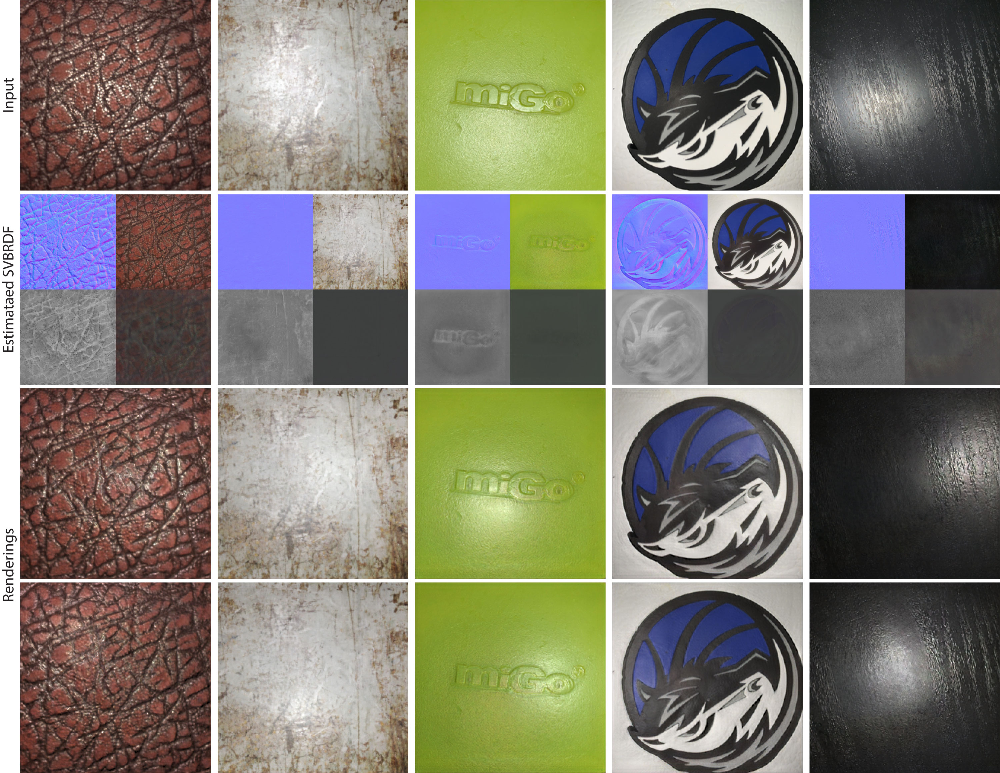

# Adversarial-Single-Image-SVBRDF-Estimation-with-Hybrid-Training
This is code of "Adversarial Single-Image SVBRDF Estimation with Hybrid Training"

## Requirements
This codebase was developed and tested with PyTorch 1.2 and Python 3.6 in both windows and Linux system.
To install environments, please use this command:

'''
conda env create -f environment.yml
'''

## Dataset

## Inference

## Training